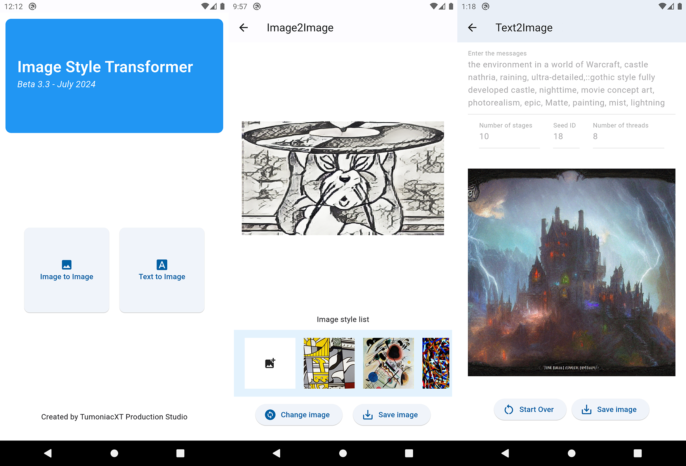

# Image Style Transformer - An Image Style Transfer Application for Mobile Devices

<h3><b>Updated version: 0.3.3 (Beta 3.3) - July 2024</b></h3>

Image Style Transformer is an Image2Image and Text2Image Style Transfer application for Mobile Devices. This application allow you to create an artistic image from a content image and a style image or from a text prompt. By using Arbitrary Style Transfer and Stable Diffusion with Quantization, we were be able to bring to model down to consumer mobile devices with compatibility for iOS and Android.

# Programming languages

 
     
     
     
     

- Mobile Application: Flutter with Swift and Java for Platform-specific codebases
- Model Creation: Python with Tensorflow and ONNX (Models have been distributed through ONNX Runtime and TFLite)

# Model Creation
In order to generate models, run the selected notebook based on which model you want to create inside folder <i>model_builder</i>. Python 3.9.x or 3.10.x are recommended.

- For Stable Diffusion models, Tensorflow 2.12.x or 2.13.x are required, newer version will not work with the app due to some problems while generating models. You will also need to install keras_cv along it and config the model output directory to put inside . Due to some problems with keras_cv library, this notebook will only work on Linux and Mac (WSL is not tested).

- For Arbitrary Style Transfer, you need to run the notebook on Google Colab due to some code will not work on local machine. This also mean the need to download the model after executing the notebook.

# Compile Mobile Application
In order to compile the application, you need to have Flutter SDK installed on your machine with Android SDK for Android devices or iOS SDK for iPhone devices. After that, make sure you have every assets required inside these folder before compiling this project:

- <i>mobile_app/assets/models</i> 
- <i>mobile_app/android/app/src/main/assets/t2i/diffusion/</i> 
- <i>mobile_app/ios/Runner/Resources/T2I/Diffusion/</i> 

When finished go to mobile_app folder and compile the project to the targeted devices to run.

<b><i>Notes: This project is not optimized for Android Tablet and iPad yet, also please do not compile on Windows and macOS, it will not work apparently.</i></b>

# Future Plan

- Implement Diffusion Inpainting feature inside the application
- Optimize application for Tablet and Desktop devices
- Experiment with Stable Diffusion XL and Stable Diffusion 3 with Negative Prompt
- Improving Arbitrary Style Transfer models for better computing performance

# Contribution and References

First of all, I would like to thank you Nguyen Duy Dat, one of my longtime co-worker supported me in model creating and project planning for this project.

I would also want to credit these repositories and scientific papers, these are the references which have heavy contribution to the creation of this project:

- https://github.com/Anthrapper/On-Device-Stable-Diffusion
- https://github.com/freedomtan/keras_cv_stable_diffusion_to_tflite
- https://github.com/pguijas/artiluxio
- https://www.tensorflow.org/hub/tutorials/tf2_arbitrary_image_stylization
- https://arxiv.org/abs/1705.06830

Also, feel free to support this project. Every contribution for this project is appreciated.